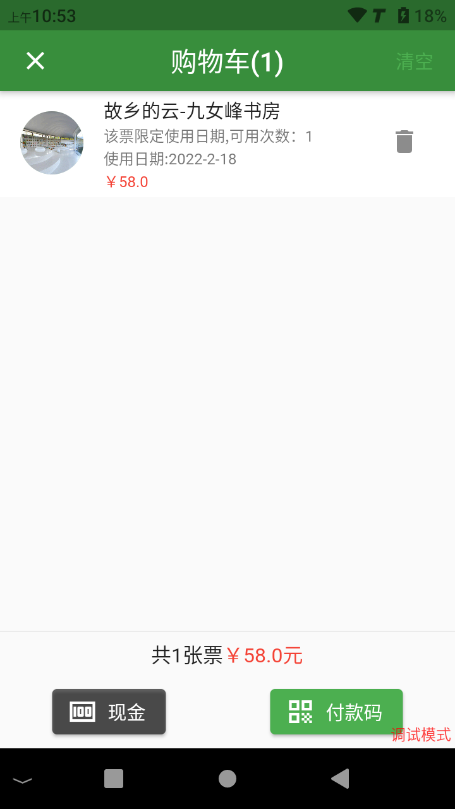

# 手持售票机

线上小程序售票+OTA售票+自助机售票+窗口人工售票覆盖了全部售票场景，但是在一些特定的场景手持售票机仍是最具机动性的。

手持机售票与其他的售票方式的后台设置一样，需要创建账号，然后设置售票权限，这里就不作赘述。

## 登录手持售票机系统

在登录之前要先设置服务器地址，在登录页面点击右上角的齿轮按钮打开设置页面，在弹出的页面中填入服务器URL

登录后就可以开始售票了

手持售票机除了又售票的功能、还有换票、重打小票、数据统计、退票的功能

